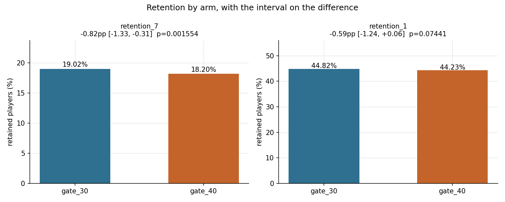
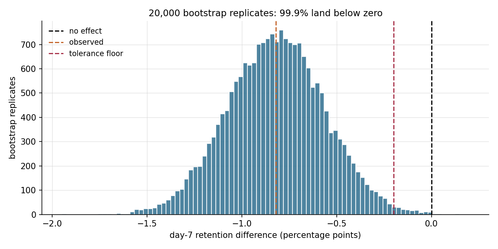
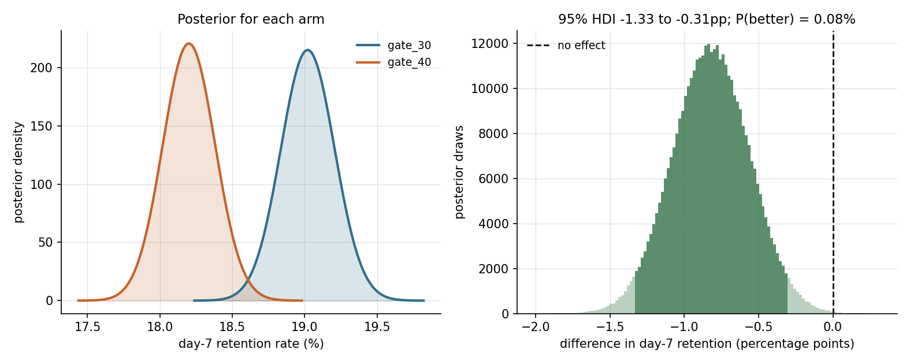
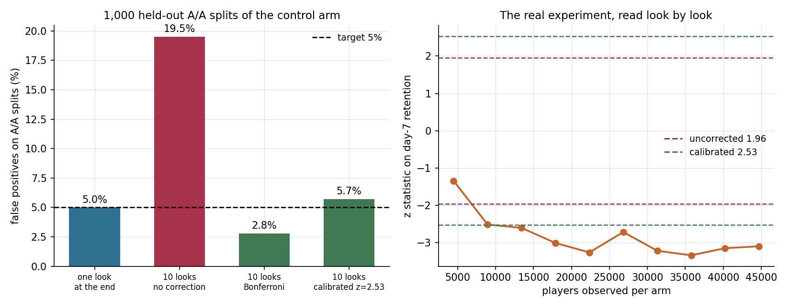
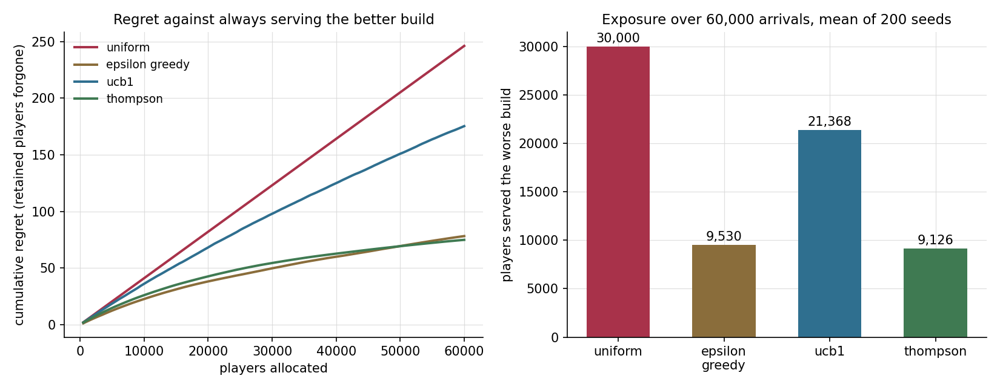
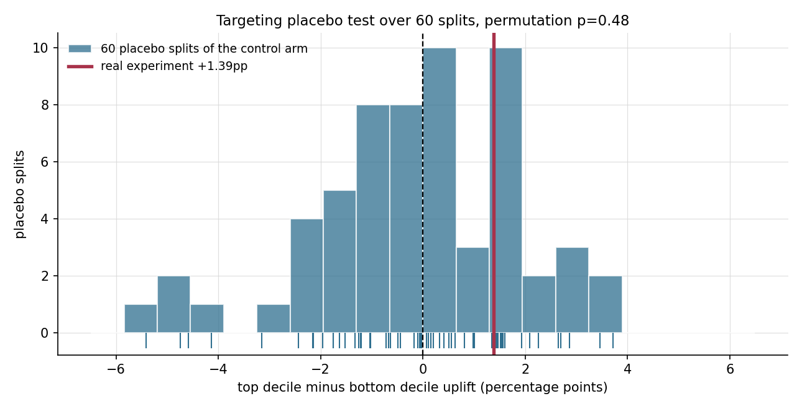
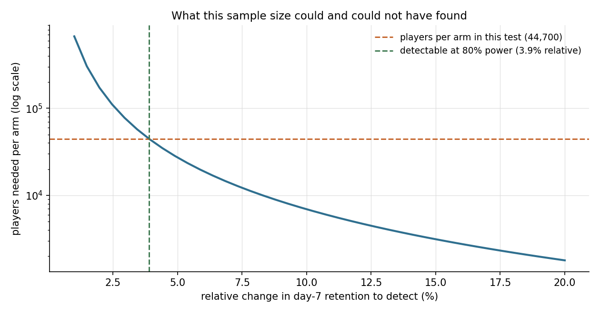
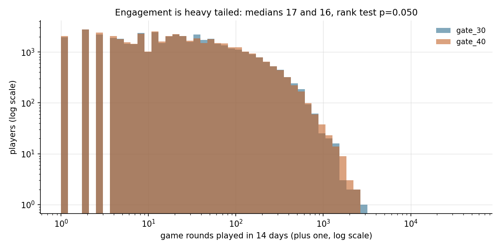

# gatecheck

[](https://github.com/ranjithguggilla/gatecheck/actions/workflows/ci.yml)
[](https://www.python.org/)
[](LICENSE)

A mobile game moved its first progression gate from level 30 to level 40 and ran the
change past 90,189 new players. Somebody then had to decide whether to keep it.
gatecheck is the tooling that turns that raw split into a decision: validity gates
first, then frequentist and Bayesian inference, then a measurement of what the usual
shortcuts would have cost, and finally one of three words with the reasons attached.

The interesting part is not that day-7 retention fell. It is how much of the
surrounding practice does not survive being checked. Peeking at this experiment ten
times inflates the false positive rate from 5.0% to 19.5%. A targeting model built on
the only features available scores an apparently strong 1.39pp uplift spread that a
placebo test puts squarely inside noise. A retention predictor reaches 0.888 ROC-AUC
entirely by reading a column that will not exist when the prediction is needed. Every
one of those numbers is measured in this repository, not asserted.

```
                    data/raw/cookie_cats.csv   90,189 players, two arms
                                 |
                                 v
                        +------------------+
                        |  data.py         |  schema checks, dtype normalising,
                        |                  |  parquet cache
                        +------------------+
                                 |
                                 v
                        +------------------+
                        |  validity.py     |  sample ratio mismatch, duplicate ids,
                        |                  |  outlier audit, covariate balance
                        +------------------+
                                 |
                gates pass       |        gates fail -> stop, verdict is "hold"
                                 v
        +------------------------+------------------------+
        |                        |                        |
        v                        v                        v
+----------------+     +------------------+     +------------------+
| frequentist.py |     |  bayes.py        |     |  resampling.py   |
| z, chi2,       |     |  Beta-Binomial   |     |  bootstrap of    |
| Newcombe CI,   |     |  posterior,      |     |  the difference, |
| Holm / BH      |     |  HDI, loss       |     |  trimmed means   |
+----------------+     +------------------+     +------------------+
        |                        |                        |
        +------------------------+------------------------+
                                 |
        +------------------------+------------------------+
        |                        |                        |
        v                        v                        v
+----------------+     +------------------+     +------------------+
|  peeking.py    |     |  bandits.py      |     |  targeting.py    |
|  A/A replays,  |     |  uniform, eps-   |     |  leakage audit,  |
|  boundary      |     |  greedy, UCB1,   |     |  T-learner,      |
|  calibration   |     |  Thompson replay |     |  placebo test    |
+----------------+     +------------------+     +------------------+
        |                        |                        |
        +------------------------+------------------------+
                                 |
                                 v
                        +------------------+
                        |  power.py        |  MDE, achieved power, size curve
                        +------------------+
                                 |
                                 v
                        +------------------+
                        |  decision.py     |  ship / hold / roll back,
                        |                  |  reasons, revenue impact
                        +------------------+
                                 |
             +-------------------+-------------------+
             v                   v                   v
      results/metrics.json   assets/*.png      app.py (Streamlit)
                                               cli.py (typer + rich)
```

## Results

All numbers below come from `results/metrics.json`, written by `gatecheck run` on the
full 90,189 row file with seed 20240917. Nothing here is rounded from memory.

### Did randomisation do its job

| gate | result |
|---|---|
| arm sizes | 44,700 control against 45,489 treatment |
| sample ratio mismatch | chi-square 6.90, p = 0.0086, above the 0.0005 alarm threshold |
| assignment entropy | 0.99994 bits against a perfect 1.0 |
| duplicate player ids | 0 of 90,189 |
| ids appearing in both arms | 0 |
| engagement outliers | max 49,854 rounds against a 99th percentile of 493, a ratio of 101 |
| pre-assignment covariates | none, so balance cannot be tested at all |

The split is uneven enough to notice. At the 0.05 threshold people habitually reach for,
it would be flagged, which is exactly why the threshold here is 0.0005: with tens of
thousands of assignments a fair coin wanders, and a team that alarms at 0.05 spends its
week investigating healthy experiments. The read is allowed to stand and the imbalance is
reported rather than buried.

### What the experiment found

| metric | control (gate_30) | treatment (gate_40) | absolute | 95% interval | relative | p |
|---|---|---|---|---|---|---|
| day-7 retention | 19.02% | 18.20% | -0.82pp | -1.33 to -0.31pp | -4.31% | 0.00155 |
| day-1 retention | 44.82% | 44.23% | -0.59pp | -1.24 to +0.06pp | -1.32% | 0.0744 |
| game rounds (14 days) | 52.46 mean, 17 median | 51.30 mean, 16 median | -0.28 trimmed mean | -1.41 to +0.91 | | 0.0502 rank test |

Three metrics get read off one experiment, so the family needs controlling. After Holm,
day-7 retention survives at p = 0.00466 and the other two do not. Benjamini-Hochberg
agrees. The engagement metric is the one worth dwelling on: its raw rank-test p value
is 0.0502, a hair outside the line, while Welch's t on winsorised values returns 0.883
and Cohen's d is -0.001. Two tests disagreeing that sharply on the same column is a
sign that the rank test is picking up a tiny shift in a huge sample rather than anything
a player would feel. The trimmed-mean bootstrap interval spans zero, so the honest
summary is that engagement did not move.



The bootstrap agrees with the closed-form interval and adds something it cannot say:
across 20,000 replicates, 99.9% land below zero and 99.2% land below the -0.20pp the
team agreed to tolerate.



The Bayesian read puts the chance the change is an improvement at 0.08%, with a 95%
highest density interval of -1.33 to -0.31pp. Expected loss from shipping is 0.82pp of
retention; expected loss from holding is 0.00005pp. The prior is Beta(1, 1), worth two
pseudo-observations against 45,000, so nobody can claim the answer was assumed.



### What the shortcuts would have cost

The control arm was split against itself 2,000 times. Both halves are the same players
under the same build, so every rejection is a false one. The first 1,000 splits
calibrate a stopping boundary and the second 1,000 measure it, because calibrating and
reporting on the same replications flatters the boundary.

| stopping rule | false positives on 1,000 held-out A/A splits |
|---|---|
| one look at the end | 5.0% |
| 10 looks, no correction | 19.5% |
| 10 looks, Bonferroni | 2.8% |
| 10 looks, boundary calibrated to z = 2.53 | 5.7% |

Peeking ten times inflates the error rate 3.9 times over. Bonferroni fixes that and
overshoots, spending error budget it did not need to. The calibrated boundary lands on
target, and the bill for it is sample size: holding 80% power, moving the critical value
from 1.96 to 2.53 requires 45% more players. That is the honest price, and it is larger
than the 29% gap between the two thresholds suggests, because sample size scales with
the square of the combined threshold.

Walking the real experiment forward, the uncorrected rule crosses at look 2 and the
calibrated boundary at look 3, which stops 62,580 player-exposures early against running
to the full sample. Both arms are truncated to the smaller of the two for this walk,
since a look is defined by equal exposure; on this data that sets aside 789 treatment
players, which is why the final-look z of -3.10 differs slightly from the full-sample
-3.16.



### Adaptive allocation, replayed

A 50/50 split is the right way to measure an effect and a wasteful way to serve players
while measuring it. Replaying 60,000 arrivals through four allocation policies, 200
seeds each, with rewards drawn from each arm's observed day-7 outcomes:

| policy | players served the worse build | cumulative regret | picked the better arm | retained players |
|---|---|---|---|---|
| uniform 50/50 | 30,000 | 246.0 | 100% | 11,176 |
| epsilon-greedy (0.1) | 9,530 (sd 12,989) | 78.2 | 95.0% | 11,351 |
| UCB1 | 21,368 (sd 2,928) | 175.2 | 99.5% | 11,247 |
| Thompson sampling | 9,126 (sd 8,533) | 74.8 | 98.5% | 11,341 |

All four policies run from the same seed, so the differences between them are not partly
differences between random streams. Thompson sampling spares 20,874 players the worse
build and ends with 164 more retained players than the fixed split, a 69.6% cut in
regret. Epsilon-greedy lands close on the averages and should not be trusted on them:
its standard deviation of 12,989 is larger than its mean, meaning it sometimes locks
onto the wrong arm early and stays there, which is also why it identifies the better arm
only 95.0% of the time. UCB1 is the opposite, almost never wrong and slow to commit.
The averages alone would rank epsilon-greedy first on exposure; the spread is what makes
Thompson the one to run.



### Two things this data cannot support

**A targeting model.** The only features available are day-1 retention and 14-day game
rounds, both measured after assignment. A T-learner built on them separates the top and
bottom score deciles by 1.39pp of uplift, which looks like a finding. Splitting the
control arm into two pseudo-arms and running the identical procedure 60 times produces
spreads averaging -0.13pp with a standard deviation of 1.95pp, reaching 5.41pp in
absolute size at the extreme. The permutation p value is 0.48. The real number sits in
the middle of the distribution of numbers the method invents when there is nothing to
find.



**A retention predictor.** Predicting day-7 retention from day-1 retention plus log game
rounds reaches 0.888 ROC-AUC in 5-fold cross validation. Dropping the game-rounds column
takes it to 0.709. The 0.179 gap is not modelling skill: `sum_gamerounds` covers days 1
to 14 and therefore contains the outcome window. At the moment a prediction would be
useful, that number does not exist yet.

| feature set | ROC-AUC | honest to use |
|---|---|---|
| day-1 retention + log game rounds | 0.888 (sd 0.002) | no, spans the outcome window |
| day-1 retention only | 0.709 (sd 0.003) | yes |
| majority class | 0.500 | yes, and it is the floor |

### What the experiment could have found

With 44,700 players per arm at a 19.02% baseline, the smallest effect detectable at 80%
power is 0.74pp absolute, or 3.90% relative. The observed -0.82pp sits just past that,
giving 88.3% achieved power. This test was adequately sized for the effect it found and
would have been blind to anything much smaller.





### The verdict

**Roll back**, high confidence.

- day-7 retention moves down by 0.82pp, 95% interval -1.33 to -0.31pp, p = 0.00155
- the posterior puts the chance the change is an improvement at 0.08%
- the whole interval sits below the -0.20pp floor the team agreed to tolerate
- the posterior chance the change is worse than the floor is 99.2%

Priced with the default assumptions, moving the gate costs roughly **$264,000 a year**,
within a range of $100,000 to $427,000 implied by the confidence interval. That rests on
1.5 million new players a month reaching the gate, $0.085 ARPDAU, 21 monetised days per
retained player, the gap persisting rather than closing, and no change to install volume
or acquisition cost. Those assumptions live in `config.py` and move on sliders in the
dashboard; anyone who disagrees can point at the one they would change.

Set against that, the Thompson replay suggests the measurement itself was more expensive
than it needed to be: a fixed 50/50 split served the worse build to 30,000 of 60,000
arrivals where adaptive allocation would have served it to 9,112.

## Installation

```bash
git clone https://github.com/ranjithguggilla/gatecheck.git
cd gatecheck
python -m venv .venv && source .venv/bin/activate
pip install -r requirements.txt
pip install -e .
```

For the test suite as well:

```bash
pip install -r requirements-dev.txt
```

Python 3.10 or newer. The dataset ships with the repository, so nothing is downloaded at
run time.

## Usage

Run the validity gates on their own. The command exits non-zero when a gate fails, which
makes it usable as a pre-analysis guard in a pipeline:

```bash
gatecheck validate
```

Run the whole thing. This writes `results/metrics.json` and eight figures into `assets/`:

```bash
gatecheck run
```

Reproduce under a different seed, or skip the figures when only the numbers matter:

```bash
gatecheck run --seed 12345
gatecheck run --skip-figures
```

Print the headline table from a completed run without recomputing:

```bash
gatecheck report
```

Open the dashboard, where the decision rules and business assumptions are sliders and
the verdict updates as they move:

```bash
streamlit run src/gatecheck/app.py
```

Use the library directly:

```python
from gatecheck.config import Config
from gatecheck.pipeline import run

artefacts = run(Config(), make_figures=False)
print(artefacts.metrics["decision"]["verdict"]["recommendation"])
```

A full run takes about 11 seconds on a laptop, most of it in the 2,000 A/A replications
and the 240,000 bandit allocation steps.

## Configuration

Everything adjustable lives in `src/gatecheck/config.py` as frozen dataclasses.

| setting | default | what it does |
|---|---|---|
| `DecisionRules.alpha` | 0.05 | significance level for every fixed-horizon test |
| `DecisionRules.min_posterior_prob_to_ship` | 0.95 | posterior probability required before a gain is shipped |
| `DecisionRules.practical_floor_pp` | -0.20 | day-7 retention the team will trade away for a cheap change |
| `DecisionRules.srm_alarm_p` | 0.0005 | sample ratio mismatch alarm, deliberately far below 0.05 |
| `BusinessAssumptions.monthly_new_players` | 1,500,000 | players reaching the gate each month |
| `BusinessAssumptions.arpdau_usd` | 0.085 | average revenue per daily active player |
| `BusinessAssumptions.days_monetised_per_retained_player` | 21 | how long a retained player keeps paying |
| `Config.bootstrap_draws` | 20,000 | bootstrap replicates for the difference in rates |
| `Config.trimmed_bootstrap_draws` | 2,000 | replicates for the skewed engagement metric |
| `Config.posterior_draws` | 400,000 | Monte Carlo draws behind the posterior summaries |
| `Config.aa_replications` | 2,000 | A/A splits, half calibration and half validation |
| `Config.interim_looks` | 10 | interim analyses in the peeking study |
| `Config.bandit_seeds` / `bandit_horizon` | 200 / 60,000 | bandit replay budget |
| `Config.placebo_runs` | 60 | placebo splits behind the targeting test |
| `Config.random_seed` | 20240917 | seeds every simulation, including the figures |

To change one without touching the file:

```python
import dataclasses
from gatecheck.config import Config, DecisionRules

config = dataclasses.replace(Config(), rules=DecisionRules(practical_floor_pp=-0.5))
```

## Output structure

```
results/metrics.json     every number in this README, keyed by section
assets/
  retention_by_arm.png         both metrics with the interval on the difference
  bootstrap_difference.png     20,000 replicates of the day-7 gap
  posterior_day7.png           per-arm posteriors and the posterior of the difference
  peeking_cost.png             A/A false positive rates and the real z trajectory
  bandit_regret.png            regret curves and exposure to the worse build
  power_curve.png              required sample size against effect size
  engagement_distribution.png  the heavy tail, on log axes
  targeting_placebo.png        the real uplift spread against 30 placebo spreads
data/interim/players.parquet   cache, ignored by git, safe to delete
```

`metrics.json` is the contract between the pipeline and everything downstream. The
dashboard reads it and this README quotes it. On `main`, CI deletes it, regenerates it
and compares the new run against the committed copy key by key, so a dependency bump
that quietly moves a number this README cites turns the build red.

## Project structure

```
gatecheck/
  src/gatecheck/
    __init__.py
    config.py        frozen dataclasses for paths, rules and business assumptions
    data.py          loading, schema enforcement, arm splitting, parquet cache
    validity.py      SRM, duplicates, outliers, covariate balance, gate summary
    frequentist.py   two-proportion z, chi-square, Newcombe and log-RR intervals,
                     Welch, Mann-Whitney, Holm and Benjamini-Hochberg
    bayes.py         Beta-Binomial posteriors, HDI, expected loss
    resampling.py    bootstrap of rate differences and trimmed means
    power.py         MDE by bisection, achieved power, sample size curves
    peeking.py       A/A replays, boundary calibration, sequential readout
    bandits.py       uniform, epsilon-greedy, UCB1 and Thompson replay
    targeting.py     leakage audit, T-learner, placebo test
    decision.py      the verdict and the revenue model
    charts.py        every figure the README embeds
    pipeline.py      orchestration and metrics assembly
    cli.py           typer commands with rich output
    app.py           Streamlit dashboard
  scripts/
    verify_metrics.py  CI check that a fresh run reproduces the committed numbers
  tests/             119 tests across 11 modules
  data/              the raw CSV and its provenance note
  assets/            generated figures
  results/           generated metrics
  .github/workflows/ci.yml
```

## Technical details

**Preprocessing lives inside the model.** Every scikit-learn estimator in
`targeting.py` is wrapped in a `Pipeline` with its scaler, so the scaler is fitted on the
training fold only. Cross-validation folds are stratified, and for the T-learner they are
stratified on the treatment-by-outcome interaction so both arms and both outcomes appear
in every fold.

**The bootstrap is exact, not brute force.** Resampling a column of zeros and ones with
replacement and taking the mean has exactly the distribution of `Binomial(n, p) / n`.
`resampling.py` draws from the binomial directly, which turns 20,000 replicates over
90,189 rows into two vectorised draws. The continuous metric gets a real resampling
bootstrap, chunked so the index matrix stays small, using a trimmed mean so one player
with 49,854 rounds cannot set the scale.

**Intervals are chosen, not defaulted.** Differences of proportions use Newcombe's hybrid
score interval, which stays inside [-1, 1] and holds its coverage near the boundaries
where the Wald interval fails. Relative lift is built on the log scale and exponentiated
back, keeping the asymmetry a ratio actually has.

**The stopping boundary is calibrated on this data.** Rather than lift a Pocock constant
from a table built for a different look schedule, `peeking.py` bisects for the flat
z-boundary whose family-wise error rate over the A/A calibration replications hits 0.05,
then reports its behaviour on replications it has never seen.

**The bandit replay is vectorised across seeds, not across time.** All 200 seeds advance
one step together, so Thompson sampling stays genuinely sequential while 60,000 steps run
in a couple of seconds. Rewards are drawn from each arm's observed day-7 outcome pool,
which for a binary outcome is exactly a Bernoulli draw at the measured rate.

**The simplest model is allowed to win.** The targeting section reports that the T-learner
found nothing, and the leakage section reports that the feature carrying most of the
apparent skill cannot be used. Neither result was the one hoped for, and both are the
result.

## Testing

```bash
ruff check .
pytest -q
```

119 tests, the full suite in about three seconds.

- `test_frequentist.py` pins the z-statistic against `statsmodels.proportions_ztest` to
  nine significant figures, and covers the degenerate tables where nobody or everybody
  converted.
- `test_properties.py` uses Hypothesis to generate arm sizes and success rates across
  five orders of magnitude, checking that p values stay in [0, 1], that swapping the arms
  flips the sign and leaves the p value untouched, that the Newcombe interval always
  brackets the observed difference, and that the sample size and power functions are
  consistent inverses of each other.
- `test_peeking.py` checks that a single look is calibrated at the nominal rate, that ten
  looks are not, and that the calibrated boundary pulls the rate back.
- `test_bandits.py` checks the uniform policy splits exactly in half, that regret is zero
  when the arms are identical, and that Thompson beats uniform on both regret and
  retained players.
- `test_decision.py` walks every branch of the verdict, including a failed validity gate
  blocking the read entirely, and checks the revenue model scales linearly with player
  volume and rollout share.
- `test_pipeline_and_app.py` runs the whole pipeline on a synthetic file, asserts all
  eight figures are written and non-trivial in size, and exercises the two pure functions
  the Streamlit dashboard depends on.

CI runs lint and tests on Python 3.10 and 3.12. On `main` it additionally removes the
committed results, runs the full analysis on the interpreter the results were recorded
on, compares every regenerated number against the committed copy, checks all eight
figures were rewritten, and uploads them as a build artifact.

## Dataset

90,189 players from an A/B test on Cookie Cats, a mobile puzzle game by Tactile
Entertainment, comparing a first progression gate at level 30 against level 40. The copy
here came from
[ryanschaub/Mobile-Games-A-B-Testing-with-Cookie-Cats](https://github.com/ryanschaub/Mobile-Games-A-B-Testing-with-Cookie-Cats).
Full column descriptions and provenance are in [data/README.md](data/README.md).

## License

MIT, see [LICENSE](LICENSE).
